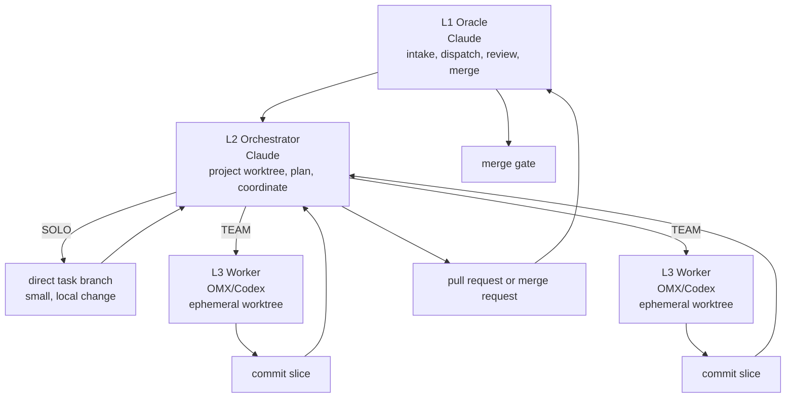

# Architecture

Gale-Framework uses a 3-layer workflow to separate durable decision-making from short-lived implementation work.



ASCII version:

```text
L1 Oracle (Claude)
  └─ L2 Orchestrator (Claude, project-scoped worktree)
       ├─ SOLO: one small direct branch
       └─ TEAM: L3 Workers (OMX/Codex, fresh worktrees)
              └─ each worker commits one focused slice
  └─ L1 reviews and merges after the L2 aggregates
```

## L1: Oracle

The L1 Oracle is the stable control point. It receives requests, decides whether work is ready to start, dispatches a task-scoped L2, reviews the final change, and owns the merge decision.

Responsibilities:

- accept or clarify task intent;
- choose SOLO or TEAM routing;
- keep merge authority separate from implementation;
- run the final review gate;
- clean up finished worktrees after merge.

The L1 layer should remain small and steady. It is the place where history, queue state, and final accountability live.

## L2: Orchestrator

The L2 Orchestrator is a Claude session started inside a fresh project worktree. It loads the project instructions from that working directory, plans the task, and either implements a small SOLO change or spawns L3 workers for TEAM work.

Responsibilities:

- inspect the actual project state;
- write a concrete plan and verification path;
- split TEAM work into independent worker slices;
- aggregate worker branches or commits;
- run unified verification;
- open or prepare the final change for L1 review.

The L2 does not merge its own work. It hands the final artifact back to L1.

## L3: Workers

L3 workers are OMX/Codex sessions created for a single implementation slice. Each worker receives a narrow brief, edits only its assigned scope, verifies its change, commits it, reports done to the L2, and stops.

Responsibilities:

- read the assigned brief and project context;
- implement one focused slice;
- run relevant checks;
- commit the slice;
- report completion or blockers to the L2.

Workers are intentionally ephemeral. A new task gets new worker sessions and fresh worktrees so context does not bleed across projects.

## Project-scope injection

Project-scope injection means every task starts from the target project's directory. The working directory determines which project instructions and configuration are loaded. This avoids using one long-running AI session for unrelated repositories.

Practical effect:

1. The L1 dispatches a task into the target project.
2. The L2 starts in a project worktree.
3. Any L3 worker also starts in a fresh project worktree.
4. The session sees the correct project instructions without carrying unrelated context from another project.

## SOLO vs TEAM routing

Use SOLO when one person can safely finish the task in a short pass, usually within one or two files and without research-heavy coordination.

Use TEAM when the task spans multiple concerns, needs parallel investigation, touches several files, adds tests across surfaces, or has unclear risk. In TEAM mode, the L2 splits the work into independent worker briefs and aggregates their commits before handing the result to L1.

## Merge gate

The merge gate keeps authoring and approval separate:

1. L3 workers commit their slices and stop.
2. L2 aggregates, verifies, and prepares the final change.
3. L1 reviews the actual code path and the final diff.
4. L1 merges only when the change matches the task and verification evidence is acceptable.

For containerized projects, deployment and rebuild steps belong after merge and should be owned by the responsible Oracle layer, not by ephemeral workers.
