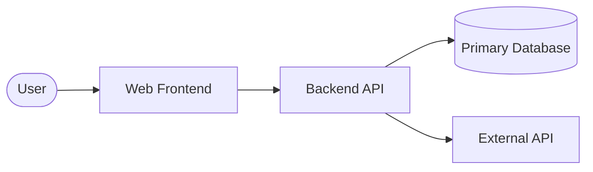
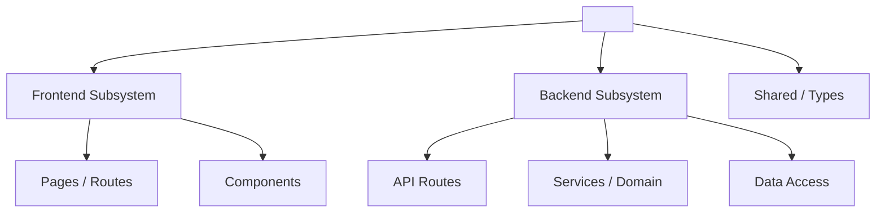
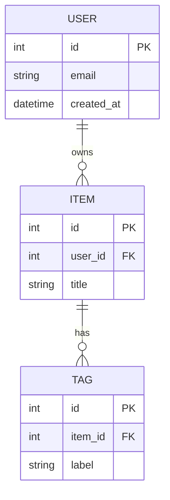
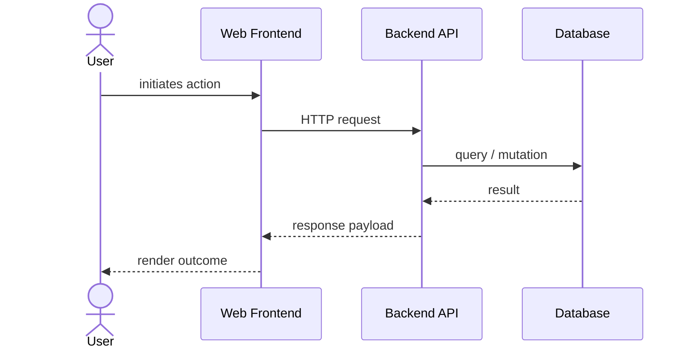
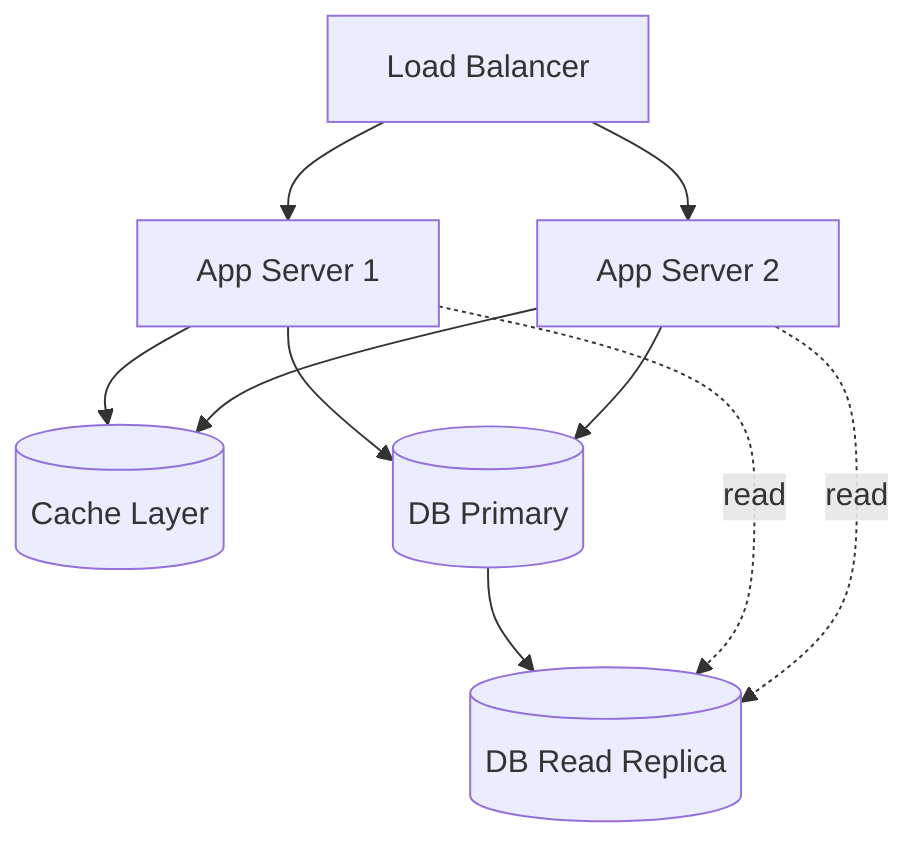

# Software Design Document — <project-name>

- **Standard**: IEEE Std 1016-2009 (Systems Design — Software Design Documents)
- **Document version**: 0.1 (template — unfilled)
- **Source markdown**: `docs/SDD.md`
- **Generated artifact**: `build/docs/sdd-<project-name>-v<ver>.docx` (Docs Pipeline)

> Scaffold file — every section carries a
> `<!-- TEMPLATE: fill before commit -->` marker. IEEE 1016-2009 organises
> the design around multiple *design views*; each view addresses specific
> stakeholder concerns. Keep the view structure; replace descriptions with
> real <project-name> design content.
>
> **Mermaid diagram blocks** are embedded directly in the relevant design
> views (Context, Composition, Information, Interaction, Resource). Each
> block is marked `%% TEMPLATE: replace with project-specific entities/flows`.
> Grep for `TEMPLATE:` to find every fill-point — both prose and diagrams.

---

## 1. Introduction

### 1.1 Purpose
<!-- TEMPLATE: fill before commit -->
*State the purpose of this SDD. Note its relationship to `SRS.md` — every
requirement in the SRS should be satisfied by at least one design element
here, tracked in `RTM.md`.*

### 1.2 Scope
<!-- TEMPLATE: fill before commit -->
*What this SDD covers vs. what is out of scope (e.g. platform internals
are out of scope).*

### 1.3 Document Conventions
<!-- TEMPLATE: fill before commit -->
*Notation conventions: Mermaid diagram dialects used (flowchart,
sequenceDiagram, erDiagram), code block language tags, requirement
reference format (`REQ-AREA-NNN`).*

---

## 2. Glossary
<!-- TEMPLATE: fill before commit -->
*Terms specific to the design. Avoid duplicating SRS glossary; link to it
instead.*

---

## 3. Identified Stakeholders and Concerns

<!-- TEMPLATE: fill before commit -->

| Stakeholder        | Primary concern                                   |
|--------------------|---------------------------------------------------|
| End User           | <concern>                                         |
| Author / Operator  | <concern>                                         |
| Operations         | Observability, deploy safety, rollback path       |
| QA                 | Testability, determinism, WCAG conformance        |
| Compliance         | CSP, PDPA (if PII), licence hygiene               |

*Adjust rows to reflect the real <project-name> stakeholder set.*

---

## 4. Design Views

Each subsection is an IEEE 1016 *design view*. A view is a partial
representation of the design addressing specific concerns. Populate the
views that are load-bearing for <project-name>; mark irrelevant views as
N/A with a one-line justification.

### 4.1 Context View
<!-- TEMPLATE: fill before commit -->
*System in its environment: external actors, external systems, integration
boundaries. The diagram below is the System Context — same shape as
SRS §2.1 but with more detail (named components, data stores, external
APIs).*

### 4.2 Composition View
<!-- TEMPLATE: fill before commit -->
*Decomposition of <project-name> into modules/packages/subsystems. Show
parent-child relationships and ownership boundaries.*

### 4.3 Logical View
<!-- TEMPLATE: fill before commit -->
*Class/module collaboration: which module owns what responsibility.
Document the dominant flows (e.g. request handling, data loading,
rendering).*

### 4.4 Information View
<!-- TEMPLATE: fill before commit -->
*Persistent data: schemas, entities, relationships, lifecycle. The
diagram below is an Entity-Relationship Diagram.*

> **N/A note**: If the project has no relational data (e.g. pure static
> site, document store, or file-based content), mark this section N/A and
> replace the ER diagram with a `flowchart` showing file/document storage
> structure instead.

### 4.5 Patterns Use View
<!-- TEMPLATE: fill before commit -->
*Architectural patterns applied: SSG, ISR, RSC boundary, server-actions,
event sourcing, CQRS, etc. Cite the source pattern and the local
adaptation.*

### 4.6 Interface View
<!-- TEMPLATE: fill before commit -->
*Programmatic interfaces: component props, route handlers, public
utilities. Document each interface's signature, pre/post-conditions, and
error contract.*

### 4.7 Interaction View
<!-- TEMPLATE: fill before commit -->
*Sequence of operations for key scenarios. The diagram below is a
sequence diagram for the most important user flow.*

### 4.8 State Dynamics View
<!-- TEMPLATE: fill before commit -->
*Client-side or server-side state machines. For a primarily static
system this may be small — state so.*

### 4.9 Algorithm View
<!-- TEMPLATE: fill before commit -->
*Non-trivial algorithms: ranking, search index construction, excerpt
extraction, scheduling. Pseudocode + complexity analysis.*

### 4.10 Resource View
<!-- TEMPLATE: fill before commit -->
*Runtime resources: serverless functions, edge runtime, CDN cache keys,
build-time memory ceilings, bundle-size budgets per route.*

### 4.11 Database Architecture
<!-- TEMPLATE: fill before commit -->
*Deployment topology for the data tier: primary, replicas, cache layer,
backup strategy, failover path.*

> **N/A note**: If the project has no database (pure static site or
> file-based storage), mark this section N/A and provide a flowchart of
> file/document storage and CDN distribution instead.

---

## 5. Design Rationale
<!-- TEMPLATE: fill before commit -->
*For each significant design decision: options considered, criteria
applied, choice made, and the cost of reversal. Keep this section honest —
design decisions rot without their rationale preserved.*

---

## Appendix A — Traceability

Every design element above should be referenced from at least one row in
`RTM.md`. Unsatisfied SRS requirements or orphan design elements are
design smells.

<!-- TEMPLATE: fill before commit -->
*Cross-check log — list any SRS requirements without corresponding design
coverage here, and any design elements without a requirement, until both
sets are empty.*

---

## Appendix B — Change History
<!-- TEMPLATE: fill before commit -->

| Version | Date       | Author | Summary of changes |
|---------|------------|--------|--------------------|
| 0.1     | YYYY-MM-DD | <author> | Initial scaffold (empty template) |
