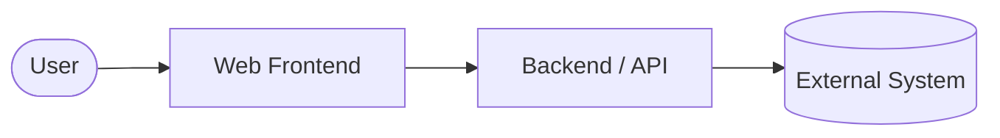
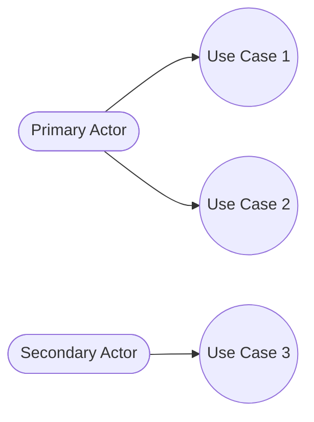

# Software Requirements Specification — <project-name>

- **Standard**: ISO/IEC/IEEE 29148:2018
- **Document version**: 0.1 (template — unfilled)
- **Source markdown**: `docs/SRS.md`
- **Generated artifact**: `build/docs/srs-<project-name>-v<ver>.docx` (Docs Pipeline)

> This file is a scaffold. Every section below contains a
> `<!-- TEMPLATE: fill before commit -->` marker that must be removed once
> real content is written. Keep each numbered heading; replace the short
> italic description with the actual requirement text.
>
> **Mermaid diagram blocks** are embedded directly in the relevant sections
> (System Context, Use Case). Each block is marked `%% TEMPLATE: replace
> with project-specific entities/flows`. Grep for `TEMPLATE:` to find
> every fill-point — both prose and diagrams.

---

## 1. Introduction

### 1.1 Purpose
<!-- TEMPLATE: fill before commit -->
*State the purpose of the SRS and the intended readership (engineers, QA,
stakeholders, auditors). Single paragraph.*

### 1.2 Scope
<!-- TEMPLATE: fill before commit -->
*Identify the product (<project-name>), list what it will do, what it will
NOT do, and the benefits, objectives, and goals. Include the product's
business context.*

### 1.3 Definitions, Acronyms, and Abbreviations
<!-- TEMPLATE: fill before commit -->
*Glossary of terms used throughout the document. Example rows:*

| Term | Definition |
|------|------------|
| TBD  | To Be Determined |
| N/A  | Not Applicable |

### 1.4 References
<!-- TEMPLATE: fill before commit -->
*Numbered list of cited documents, standards, and external specs. Include
ISO/IEC/IEEE 29148:2018 itself, the repo README, and any upstream specs.*

### 1.5 Overview
<!-- TEMPLATE: fill before commit -->
*One paragraph describing the rest of the SRS — section-by-section roadmap
for the reader.*

---

## 2. Overall Description

### 2.1 Product Perspective
<!-- TEMPLATE: fill before commit -->
*Where does <project-name> fit in the larger system? Upstream
dependencies, downstream consumers, integration points. The diagram below
is the System Context Diagram — the highest-level view of the product
and its actors.*

### 2.2 Product Functions
<!-- TEMPLATE: fill before commit -->
*High-level summary of major functions. Bullet list, 5–15 items. Details
belong in §3, not here.*

### 2.3 User Characteristics
<!-- TEMPLATE: fill before commit -->
*Who uses <project-name>? Persona breakdown. Note technical literacy,
language, assistive-tech needs (WCAG 2.1 AA baseline).*

### 2.4 Constraints
<!-- TEMPLATE: fill before commit -->
*Regulatory, hardware, interface, parallel-operation, and
reliability/security constraints. Include platform limits, CSP rules,
budget caps.*

### 2.5 Assumptions and Dependencies
<!-- TEMPLATE: fill before commit -->
*Conditions assumed to be true. If any becomes false, requirements may
change.*

### 2.6 Apportioning of Requirements
<!-- TEMPLATE: fill before commit -->
*Which requirements are deferred to later releases vs. in-scope for v1.
Optional — remove if not applicable.*

---

## 3. Specific Requirements

Each requirement MUST have a unique ID (`REQ-<area>-<nnn>`), be
testable/verifiable, and be traced in `RTM.md`.

### 3.1 External Interface Requirements

#### 3.1.1 User Interfaces
<!-- TEMPLATE: fill before commit -->
*Describe each UI screen, navigation flow, and accessibility behaviour.
Reference design mockups or Figma links.*

#### 3.1.2 Hardware Interfaces
<!-- TEMPLATE: fill before commit -->
*Mark N/A if none. Web apps typically have no direct hardware interface.*

#### 3.1.3 Software Interfaces
<!-- TEMPLATE: fill before commit -->
*External APIs, libraries, frameworks, integrations. For each: name,
version range, purpose, and failure behaviour.*

#### 3.1.4 Communications Interfaces
<!-- TEMPLATE: fill before commit -->
*HTTP(S), webhooks, message queues, RSS, sitemap endpoints. Include
protocol versions, authentication, and rate limits.*

### 3.2 Functional Requirements
<!-- TEMPLATE: fill before commit -->
*One subsection per major function. The diagram below is a Use Case
overview — actors on the left, use cases on the right. Mermaid lacks a
native `useCaseDiagram`; we use `flowchart LR` with `(())` (rounded
rectangles for use cases) and `([])` (stadiums for actors) to approximate
the UML notation.*

*Example skeleton for each requirement:*

#### REQ-AREA-001 — <short title>
- **Description**: *(what the system shall do)*
- **Rationale**: *(why)*
- **Source**: *(stakeholder, issue, PR)*
- **Priority**: Must / Should / Could
- **Verification**: Test / Demo / Inspection / Analysis

### 3.3 Non-Functional Requirements (Quality Attributes)

#### 3.3.1 Performance
<!-- TEMPLATE: fill before commit -->
*Measurable targets: Time-to-First-Byte, Largest Contentful Paint,
Interaction-to-Next-Paint, throughput, latency. Include the
instrumentation method.*

#### 3.3.2 Security
<!-- TEMPLATE: fill before commit -->
*CSP policy, secrets handling, dependency scanning cadence, reporting
channel. Map to OWASP Top 10 where applicable.*

#### 3.3.3 Usability
<!-- TEMPLATE: fill before commit -->
*WCAG 2.1 AA conformance targets, keyboard-only flows, screen-reader
labelling, colour-contrast ratios.*

#### 3.3.4 Reliability
<!-- TEMPLATE: fill before commit -->
*Uptime target, error-budget, graceful-degradation behaviour when
upstream dependencies are unavailable.*

#### 3.3.5 Portability
<!-- TEMPLATE: fill before commit -->
*Target browsers, operating systems, screen sizes. State the build-time
vs. runtime portability constraints.*

#### 3.3.6 Maintainability
<!-- TEMPLATE: fill before commit -->
*Coding-standard conformance, test-coverage floor, documentation currency
expectation.*

### 3.4 Design Constraints
<!-- TEMPLATE: fill before commit -->
*Technology choices dictated externally (framework, hosting, theme).
Standards compliance requirements.*

### 3.5 Other Requirements
<!-- TEMPLATE: fill before commit -->
*Legal, localisation, cultural, political, or any requirement that does
not fit the sections above.*

---

## 4. Verification

For every requirement in §3, define HOW it will be verified. Standard
verification methods per IEEE 29148: **Test (T), Demonstration (D),
Inspection (I), Analysis (A)**.

<!-- TEMPLATE: fill before commit -->

| REQ-ID            | Method | Evidence                         |
|-------------------|--------|----------------------------------|
| REQ-AREA-001      | T      | `tests/e2e/<area>.spec.ts`       |
| REQ-PERF-001      | A      | Lighthouse report in CI          |

*Populate the table with one row per requirement. Pass criteria are the
authoritative measurement thresholds — they must match the thresholds
declared in §3.*

---

## 5. Appendices

### Appendix A — Assumptions Log
<!-- TEMPLATE: fill before commit -->
*Running log of assumptions that were revisited during development.*

### Appendix B — Open Issues
<!-- TEMPLATE: fill before commit -->
*Requirements still under discussion. Each open issue gets an owner and a
target resolution date.*

### Appendix C — Change History
<!-- TEMPLATE: fill before commit -->

| Version | Date       | Author | Summary of changes |
|---------|------------|--------|--------------------|
| 0.1     | YYYY-MM-DD | <author> | Initial scaffold (empty template) |
