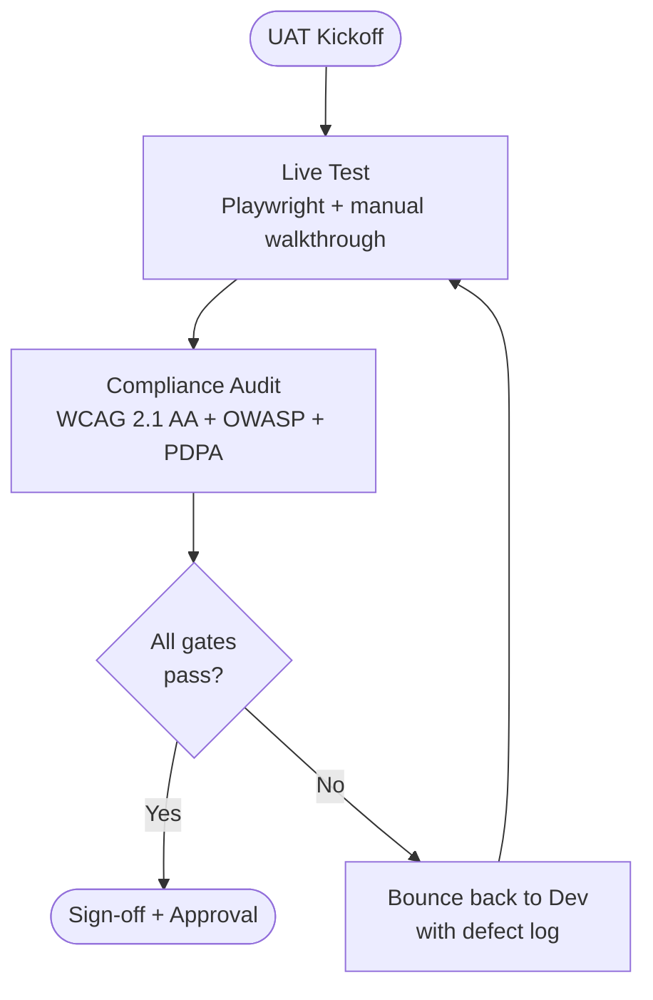

# User Acceptance Test Plan — <project-name>

- **Standard**: IEEE Std 829-2008 (Test Documentation — Master Test Plan)
- **Document version**: 0.1 (template — unfilled)
- **Source markdown**: `docs/UAT.md`
- **Primary deliverable**: `build/docs/uat-<project-name>-v<ver>.xlsx` (multi-sheet, Docs Pipeline)

> **XLSX target**: this markdown is the source of truth; the `/document-skills:xlsx` skill generates
> the multi-sheet XLSX from it. Sheet mapping:
>
> | XLSX Sheet | Contents | Source sections |
> |------------|----------|-----------------|
> | **Sheet 1 — Plan Overview** | All plan-level metadata and narrative | §1–§7, §12–§16 |
> | **Sheet 2 — Test Cases** | Full tabular test case register | §6 (feature map) + §8 (test cases table) |
> | **Sheet 3 — Pass-Fail Tracking** | Cycle-by-cycle execution results | §17 |
>
> Scaffold file. IEEE 829-2008 specifies a 16-clause structure for a test plan document; the headings
> below preserve that order. Replace each `<!-- TEMPLATE: fill before commit -->` marker with
> <project-name> specifics.
>
> **Mermaid diagram block** in §8 (Approach) shows the UAT test flow (Live Test → Compliance Audit →
> Pass/Fail decision). Marked `%% TEMPLATE:` for project-specific tooling substitutions.

---

## 1. Test Plan Identifier
<!-- TEMPLATE: fill before commit -->
*Unique ID for this plan. Convention: `UAT-<PROJECT-NAME>-v<MAJOR>.<MINOR>`.*

## 2. References
<!-- TEMPLATE: fill before commit -->
*List documents this plan depends on — SRS.md, SDD.md, RTM.md, relevant
standards (IEEE 829-2008, WCAG 2.1), and any upstream contracts.*

## 3. Introduction
<!-- TEMPLATE: fill before commit -->
*Purpose of UAT, scope of the test effort, business context. Summarise
what "acceptable" means for <project-name> v1.*

## 4. Test Items
<!-- TEMPLATE: fill before commit -->
*What is being tested. Items are SRS features plus any build-time
artifacts. Version and transmittal method for each item.*

## 5. Software Risk Issues
<!-- TEMPLATE: fill before commit -->
*Risks that could cause UAT to fail or be deferred. Each risk has a
mitigation owner.*

## 6. Features to be Tested
<!-- TEMPLATE: fill before commit -->
*Cross-reference table: feature → SRS REQ-ID → UAT case ID. Every feature
listed MUST appear in `RTM.md`. This table becomes **Sheet 2 — Test Cases** rows 1–N.*

| Feature                       | SRS REQ-ID        | UAT case ID |
|-------------------------------|-------------------|-------------|
| <feature name>                | REQ-AREA-001      | UAT-001     |

## 7. Features NOT to be Tested
<!-- TEMPLATE: fill before commit -->
*Explicitly list out-of-scope features and why (deferred, external, or
covered by other test levels). This section protects the plan against
scope creep during execution.*

## 8. Approach
<!-- TEMPLATE: fill before commit -->
*Test strategy: manual vs. automated, tooling (Playwright, Lighthouse,
axe-core, manual walkthrough), environments (preview vs. production),
data setup. State the entry criteria for UAT to begin.*

*The flow below is the standard QA Oracle UAT loop: every feature passes
through Live Test then Compliance Audit before sign-off. Failure at
either gate routes back to the dev with specific defect details.*

### Test Case Register
<!-- TEMPLATE: fill before commit — one row per UAT case; this table IS Sheet 2 of the XLSX output -->

| ID      | Description | REQ-link | Pre-conditions | Steps | Expected Result | Status | Tester | Date |
|---------|-------------|----------|----------------|-------|-----------------|--------|--------|------|
| UAT-001 | <!-- TEMPLATE: fill --> | REQ-AREA-001 | <!-- TEMPLATE: fill --> | <!-- TEMPLATE: fill --> | <!-- TEMPLATE: fill --> | Pending | QA Oracle | |

*`Status` values: `Pending` / `Pass` / `Fail` / `Blocked`. Tester fills Status + Date during each
UAT cycle. The XLSX skill generates this register as a formatted table in Sheet 2 with locked
header row and status dropdown validation.*

## 9. Item Pass/Fail Criteria
<!-- TEMPLATE: fill before commit -->
*Objective criteria per test item. Every criterion must be measurable.
Example: "UAT-PERF-001 passes when Largest Contentful Paint ≤ 2.5 s on
preview URL measured via Lighthouse CI median of 3 runs."*

## 10. Suspension Criteria and Resumption Requirements
<!-- TEMPLATE: fill before commit -->
*Conditions that pause UAT (e.g. > 3 blocker bugs open simultaneously,
preview environment down > 1 hour). Define what must be true before
testing resumes.*

## 11. Test Deliverables
<!-- TEMPLATE: fill before commit -->
*Artifacts produced by UAT: executed test report, defect log, screenshot
evidence, accessibility audit, sign-off document. State storage location
and retention.*

## 12. Remaining Test Tasks
<!-- TEMPLATE: fill before commit -->
*Tasks outstanding at the time of plan approval. Review this section at
each UAT status meeting; empty by UAT completion.*

## 13. Environmental Needs
<!-- TEMPLATE: fill before commit -->
*Hardware, software, network, data, and facility resources required.
Include test account credentials source (never embed live creds — link
to secrets manager).*

## 14. Staffing and Training Needs
<!-- TEMPLATE: fill before commit -->
*Who executes UAT: QA Oracle primary, with named backup. Training
required for any tool not already in the QA kit.*

## 15. Schedule
<!-- TEMPLATE: fill before commit -->
*Milestones and dates: UAT kickoff, test execution window, defect
triage, re-test window, sign-off meeting. Identify dependencies on dev
completion.*

## 16. Approvals
<!-- TEMPLATE: fill before commit -->

| Role                  | Name        | Signature / Approval channel | Date |
|-----------------------|-------------|------------------------------|------|
| QA Lead               | QA Oracle | arra_handoff / PR approval   |      |
| Engineering Lead      | My Oracle | PR approval                  |      |
| Product Owner         | Your Name        | Written acknowledgement      |      |

*UAT is not complete until every row in this table has a dated approval.*

## 17. Pass-Fail Tracking Template
<!-- TEMPLATE: fill before commit — one row per test cycle; this section becomes Sheet 3 of the XLSX -->

*Sheet 3 is the cycle-by-cycle execution log. QA Oracle (or the assigned tester) appends one block per
UAT cycle. The XLSX skill renders this as a separate sheet with auto-filter and conditional
formatting (Pass=green, Fail=red, Blocked=amber).*

| Cycle | UAT case ID | Test date | Tester | Environment | Result | Defect ID | Notes |
|-------|-------------|-----------|--------|-------------|--------|-----------|-------|
| 1     | UAT-001     | YYYY-MM-DD | QA Oracle  | preview     | Pending |          |       |

*`Defect ID` links to the GitHub issue number raised for that failure. Leave blank on Pass.*

---

## Appendix — Change History
<!-- TEMPLATE: fill before commit -->

| Version | Date       | Author | Summary of changes |
|---------|------------|--------|--------------------|
| 0.1     | YYYY-MM-DD | <author> | Initial scaffold (empty template) |
